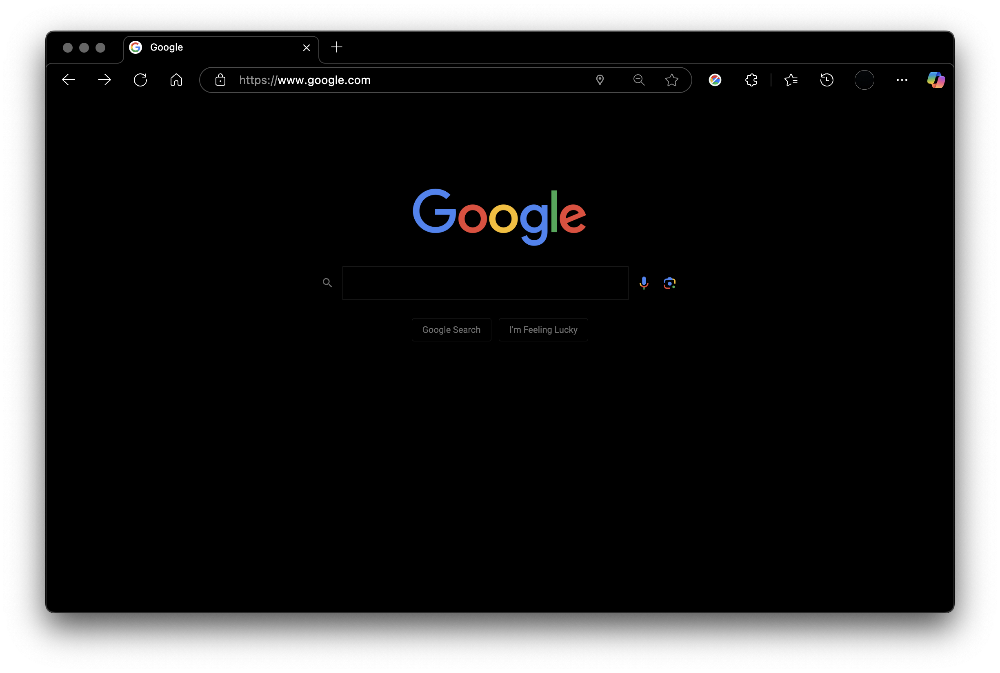
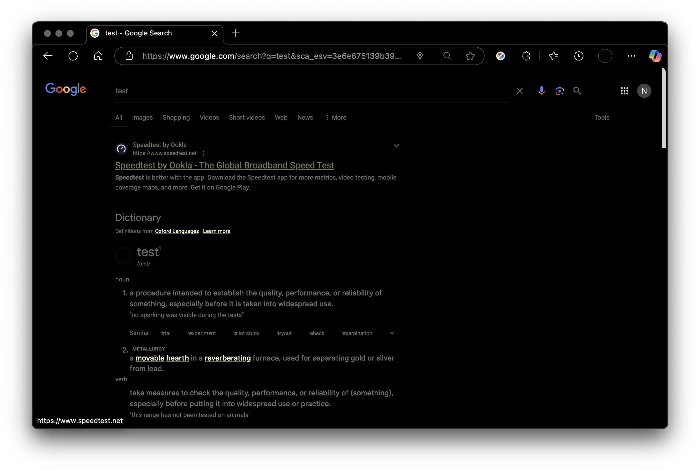

# Chrome OLED Mode Extension
**Hides the daily Google Doodle of the day, providing a distraction-free search environment*

[Download Latest Release](https://github.com/FreelanceProgrammingServices/Hide-Google-Doodles/releases/latest)

## Installation

1. Download the latest `Hide-Google-Doodles.crx` from the [releases page](https://github.com/yourusername/Hide-Google-Doodles/releases/latest) 
2. Go to chrome://extensions and enable Developer mode 
3. Load Unpacked and select folder containing extracted files

## Support
Tested on:
 Google Chrome Version 135.0.3179.85

## License

This project is released under Public Domain.

---

